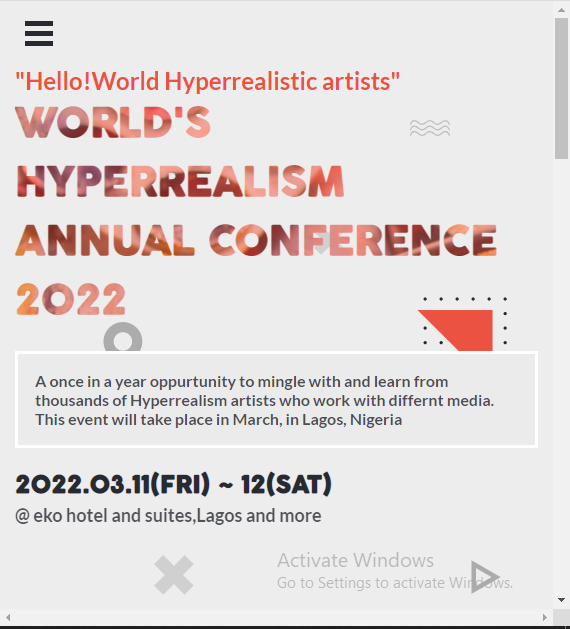
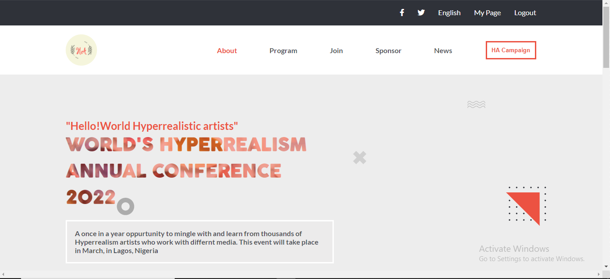
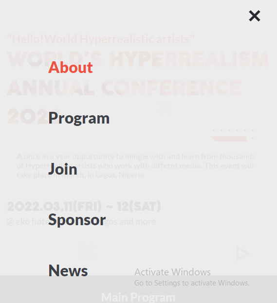

# HYPERREALISM ARTISTS' CONFERENCE

>  This is the page view:

> |     | Mobile version                      | Desktop version                      |     |
> | --- | ----------------------------------- | ------------------------------------ | --- |
> |     |  |  |

> |Mobile menu                 |
> | -------------------------- |
> |  |

The project is a website for a conference that brings together artists from different parts of the world to engage with one another. It only shows the home-page and the about page

## Built With

- Major languages :HTML, JavaScript, CSS
- Frameworks : N/A

## Live Demo (if available)

[Live Demo Link](https://tylher.github.io/first-capstone/)

## Getting Started

To get a local copy up and running follow these simple example steps.

### Prerequisites
- Understand how HTML and CSS work
- Understand github and gitflow

### Install
To view and edit this project, you need to install the following,
- Any web browser of your choice
- Git and Gitbash
- Any code editor of your choice

### Usage
- To clone the repository run this command `git clone git@github.com:tylher/first-capstone.git` in your command line

### Run tests
For tracking linters errors locally you need to follow these steps:

- After cloning the project you need to run this command

  > npm install
  > `This command will download all the dependencies of the project`

- For tracking the linter errors in HTML file run:

  > npx hint .

- For tracking the linter errors in CSS file run:

  > npx stylelint "\*_/_.{css,scss}"

  - And For tracking the linter errors in JavaScript file run:
    > npx eslint .

### Deployment
- GitHub Pages was used to deploy my website
- For more information, see "[About github page](https://docs.github.com/en/pages/getting-started-with-github-pages/about-github-pages#publishing-sources-for-github-pages-sites)"

## Authors

👤 **Author1**

- GitHub: [@tylher](https://github.com/tylher)
- Twitter: [@tylher123](https://twitter.com/tylher123)
- LinkedIn: [Taiwo Adediran](https://www.linkedin.com/in/taiwo-adediran-327654127/)

## 🤝 Contributing

Contributions, issues, and feature requests are welcome!

## Show your support

Give a ⭐️ if you like this project!

## Acknowledgments
- Design and inspiration by [Cindy Shin on Behance](https://www.behance.net/gallery/29845175/CC-Global-Summit-2015).
- Hat tip to anyone whose code was used

## 📝 License

This project is [MIT](./MIT.md) licensed.
